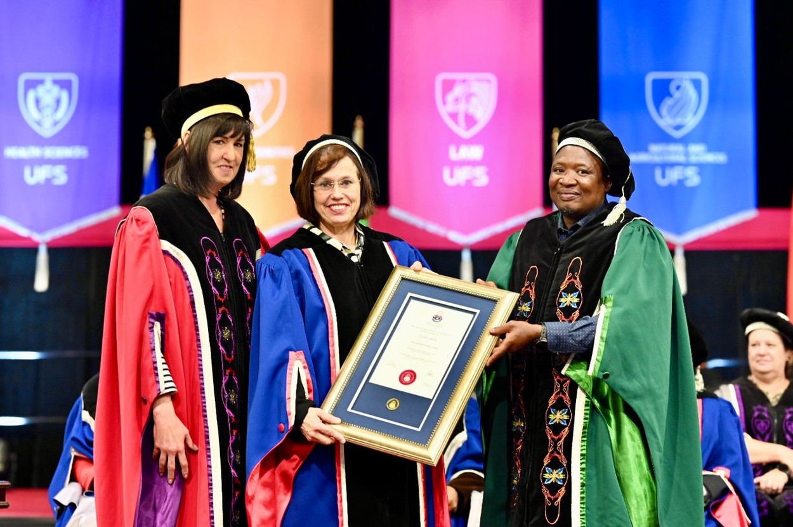

During the University of the Free State (UFS)'s April graduation ceremony, Anmari van der Westhuizen received the UFS Council Medal. ["Through her performances, recordings, and teaching, she has made a lasting contribution to the development of classical music and music education"](https://www.ufs.ac.za/templates/news-archive-item/campus-news/2026/march/university-of-the-free-state-to-confer-honorary-doctorates-and-award-council-medal-at-april-2026-graduations).

Speaking with Anthony Mthembu for UFS campus news, Anmari said that this award is not merely a personal honour, but symbolises a ["recognition of a shared artistic vision and collective commitment"](https://www.ufs.ac.za/templates/news-archive-item/campus-news/2026/april/council-medal-recognises-prof-van-der-westhuizen-joubert-s-role-in-expanding-access-to-music-education).

Anmari receives the Council Medal, pictured with Vice-Chancellor Prof. Hester Klopper and Registrar Mr. Nikile Ntsababa. (Photo by Kaleidoscope Studios for the UFS.)
